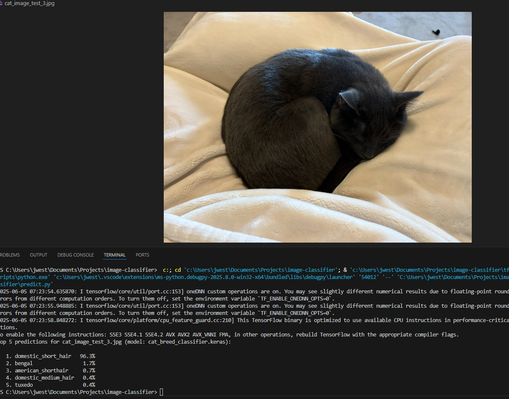

# Classy Cats - Cat Breed Classifier

A complete machine learning pipeline for identifying cat breeds from images using computer vision and deep learning techniques.

## Overview

This project combines YOLO object detection with a CNN classifier to automatically detect cats in images and classify their breeds. The system uses transfer learning with MobileNetV2 for efficient and accurate breed classification.



## Features

- **Automated cat detection**: Uses YOLOv8 to detect and crop cats from images
- **Breed classification**: CNN classifier trained on cropped cat images
- **Data pipeline**: Complete workflow from dataset download to model training
- **Easy prediction**: Simple interface for classifying new cat images

## Project Structure

```
├── download_dataset.py    # Download and prepare Kaggle cat breeds dataset
├── crop_images.py         # YOLO-based cat detection and cropping
├── train_classifier.py    # Train the breed classification model
├── predict.py            # Classify cat breeds in new images
└── README.md             # Setup instructions
```

## Setup

### Prerequisites

1. **Install Python 3.11**
   ```bash
   winget install --id Python.Python.3.11 -e
   ```

2. **Create virtual environment**
   ```bash
   py -3.11 -m venv tf-env
   tf-env\Scripts\activate  # Windows
   # source tf-env/bin/activate  # Linux/Mac
   ```

3. **Install dependencies**
   ```bash
   python -m pip install --upgrade pip setuptools wheel
   pip install tensorflow-cpu opencv-python ultralytics kagglehub
   ```

## Usage

### 1. Download and Prepare Dataset
```bash
python download_dataset.py
```
Downloads the Kaggle cat breeds dataset and organizes images into breed folders.

### 2. Detect and Crop Cats
```bash
python crop_images.py
```
Uses YOLOv8 to detect cats in images and creates cropped versions for training.

### 3. Train the Classifier
```bash
python train_classifier.py --data_dir cropped_cats --epochs 10
```
Trains a MobileNetV2-based classifier on the cropped cat images.

### 4. Classify New Images
```bash
python predict.py path/to/cat_image.jpg
```

## Model Performance

The classifier shows strong performance on various cat breeds. Example predictions:

- **Domestic Short Hair**: 96.3% confidence
- **Tuxedo**: 37.1% confidence  
- **American Shorthair**: 5.6% confidence

## Configuration

Key parameters can be adjusted in each script:

- **Image size**: 128×128 pixels (configurable in `train_classifier.py`)
- **YOLO confidence**: 0.4 threshold for cat detection
- **Batch size**: 32 for training
- **Validation split**: 20% of data

## Requirements

- Python 3.11+
- TensorFlow 2.x
- OpenCV
- Ultralytics YOLO
- Kaggle API access (for dataset download)

## Dataset

Uses the [Cat Breeds Dataset](https://www.kaggle.com/datasets/ma7555/cat-breeds-dataset) from Kaggle, which contains images of various cat breeds organized by breed type.

## Technical Details

- **Object Detection**: YOLOv8n for cat detection and cropping
- **Classification**: MobileNetV2 with transfer learning
- **Data Augmentation**: Built into TensorFlow's image dataset utilities
- **Output**: Top-5 breed predictions with confidence scores
